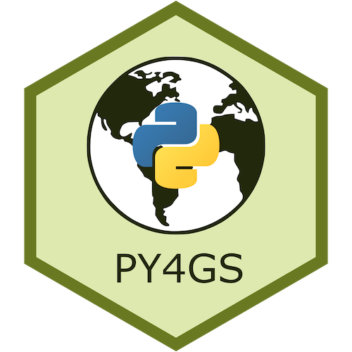

# Python for Geospatial Analysis

**By [Tomas Beuzen](https://www.tomasbeuzen.com/) 🚀**

Welcome to Python for Geospatial Analysis! With this [website](https://www.tomasbeuzen.com/python-for-geospatial-mapping-modelling/) I aim to provide a crashcourse introduction to using Python to wrangle, plot, and model geospatial data. We'll be using libraries such as `geopandas`, `plotly`, `keplergl`, and `pykrige` to these ends.

<p align="center">
  
</p>

>If you're interested in learning more about Python packages, check out my other resources:
>- [Python Packaging](https://py-pkgs.org/)
>- [Python Programming for Data Science](https://www.tomasbeuzen.com/python-programming-for-data-science/README.html)
>- [Deep Learning with PyTorch](https://www.tomasbeuzen.com/deep-learning-with-pytorch/)

>The content of this site is adapted from material I used to teach the 2020/2021 offering of the course "DSCI 574 Spatial and Temporal Models" for the University of British Columbia's Master of Data Science Program.

## Key Learning Outcomes

These are the key learning outcomes for this material:

1. Translate fundamental programming concepts such as loops, conditionals, etc into Python code.
2. Understand the key data structures in Python.
3. Understand how to write functions in Python and assess if they are correct via unit testing.
4. Know when and how to abstract code (e.g., into functions, or classes) to make it more modular and robust.
5. Produce human-readable code that incorporates best practices of programming, documentation, and coding style.
6. Use NumPy perform common data wrangling and computational tasks in Python.
7. Use Pandas to create and manipulate data structures like Series and DataFrames.
8. Wrangle different types of data in Pandas including numeric data, strings, and datetimes.

## Getting Started

The material on this site is written in Jupyter notebooks and rendered using [Jupyter Book](https://jupyterbook.org/intro.html). However, if you wish to run these notebooks on your local machine, you can do the following:

1. Clone the GitHub repository:
   ```sh
   git clone https://github.com/TomasBeuzen/python-for-geospatial-analysis.git
   ```
2. Install the conda environment by typing the following in your terminal:
   ```sh
   conda env create -f py4gs.yaml
   ```
3. Open the course in JupyterLab by typing the following in your terminal:
   ```sh
   cd python-for-geospatial-analysis
   jupyterlab
   ```

>If you're not comfortable with `git`, `GitHub` or `conda`, feel free to just read through the material on this website - you're not missing out on anything! 
